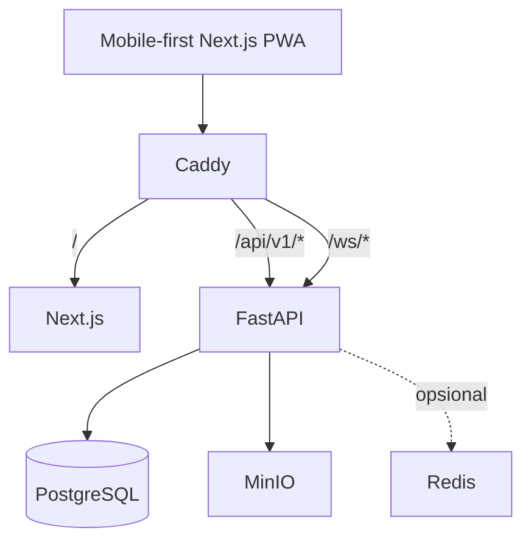

# Arsitektur Jepret

## Runtime foundation

## Komponen

- **Caddy (gateway)** — entry point tunggal `:8080`, kompresi, routing same-origin.
- **Next.js (web)** — PWA shell mobile-first, output standalone, TanStack Query boundary.
- **FastAPI (api)** — modular monolith; system routes (`/health`, `/ready`, `/ws/health`), error envelope stabil, correlation ID, structured logging.
- **PostgreSQL** — source of truth; akses async via SQLAlchemy + asyncpg; schema dikelola Alembic.
- **MinIO** — object storage lokal dengan bucket `jepret-public` dan `jepret-private`.
- **Redis** — profile Compose opsional; tidak diperlukan stack dasar.

## Request flow

1. Browser memanggil `http://localhost:8080/...` (satu origin untuk web, REST, dan WebSocket).
2. Caddy meneruskan `/health`, `/ready`, `/api/v1/*`, `/api/docs*`, `/api/openapi.json`, dan `/ws/*` ke FastAPI; sisanya ke Next.js.
3. `CorrelationIdMiddleware` membaca atau membuat `X-Request-ID` dan mengembalikannya pada response.
4. Error API selalu memakai envelope `{"error": {"code", "message", "details"}}`; sukses memakai `{"data": ...}`.

## Planned auth flow (Phase 2)

Authentication berbasis session cookie melalui origin yang sama sehingga tidak memerlukan CORS. Endpoint auth berada di bawah `/api/v1/auth/*`; proteksi CSRF memanfaatkan perilaku same-origin gateway. Detail difinalisasi pada fase auth.

## Planned storage flow (fase fitur)

Upload media memakai bucket privat dengan signed URL berbatas waktu yang diterbitkan API setelah authorization. Bucket publik hanya untuk aset non-sensitif. Tidak ada direct public read terhadap bucket privat.

## WebSocket flow

`/ws/health` adalah probe infrastruktur untuk memvalidasi penerusan upgrade WebSocket oleh gateway. Business WebSocket terautentikasi (chat) ditambahkan pada Phase 6 melalui prefix `/ws/*` yang sama.

## ADR-001: Same-origin Caddy gateway

**Status:** Accepted

Caddy menjadi entry point tunggal agar cookie, CSRF, REST, dan WebSocket memiliki perilaku origin yang konsisten. PostgreSQL dan MinIO tetap internal; direct debug port memakai compose override eksplisit.
