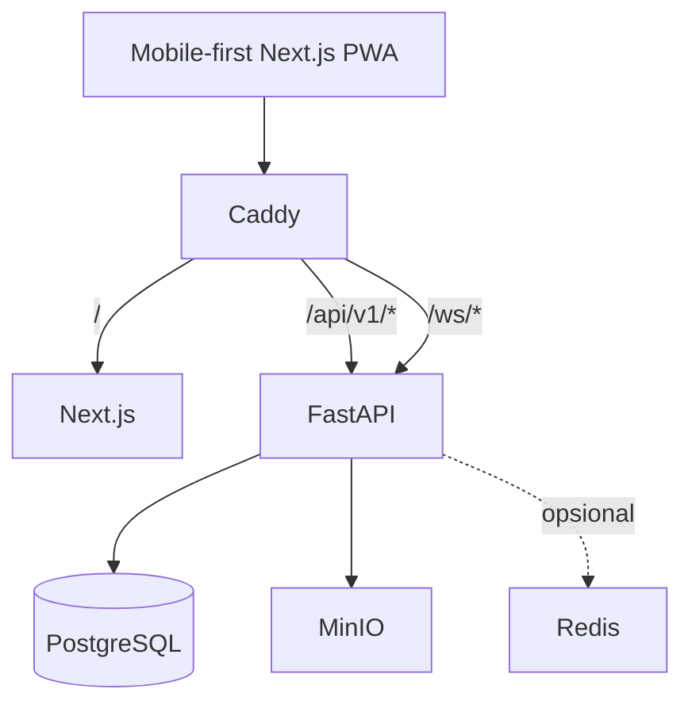

# Arsitektur Jepret

## Runtime foundation

## ADR-001: Same-origin Caddy gateway

**Status:** Accepted

Caddy menjadi entry point tunggal agar cookie, CSRF, REST, dan WebSocket memiliki perilaku origin yang konsisten. PostgreSQL dan MinIO tetap internal; direct debug port memakai compose override eksplisit.
