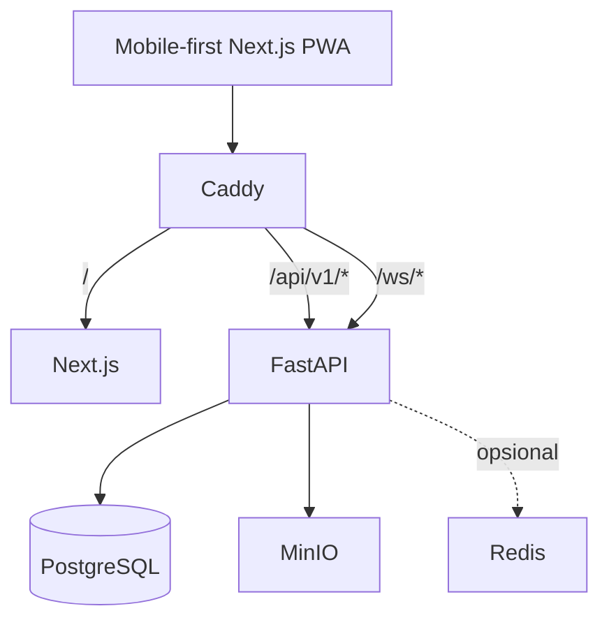

# Arsitektur Jepret

## Runtime foundation

```mermaid
flowchart TD
  PWA["Mobile-first Next.js PWA"] --> Caddy
  Caddy -->|/| Web[Next.js]
  Caddy -->|/api/v1/*| API[FastAPI]
  Caddy -->|/ws/*| API
  API --> DB[(PostgreSQL)]
  API --> MinIO
  API -. opsional .-> Redis
```

## Komponen

- **Caddy (gateway)** — entry point tunggal `:8080`, kompresi, routing same-origin.
- **Next.js (web)** — PWA shell mobile-first, output standalone, TanStack Query boundary.
- **FastAPI (api)** — modular monolith; system routes (`/health`, `/ready`, `/ws/health`), error envelope stabil, correlation ID, structured logging.
- **PostgreSQL** — source of truth; akses async via SQLAlchemy + asyncpg; schema dikelola Alembic.
- **MinIO** — object storage lokal dengan bucket `jepret-public` dan `jepret-private`.
- **Redis** — profile Compose opsional; tidak diperlukan stack dasar.

## Request flow

1. Browser memanggil `http://localhost:8080/...` (satu origin untuk web, REST, dan WebSocket).
2. Caddy meneruskan `/health`, `/ready`, `/api/v1/*`, `/api/docs*`, `/api/openapi.json`, dan `/ws/*` ke FastAPI; sisanya ke Next.js.
3. `CorrelationIdMiddleware` membaca atau membuat `X-Request-ID` dan mengembalikannya pada response.
4. Error API selalu memakai envelope `{"error": {"code", "message", "details"}}`; sukses memakai `{"data": ...}`.

## Auth flow (Phase 2 — implemented)

Authentication berbasis session cookie same-origin tanpa CORS. Password di-hash Argon2id (pwdlib); session opaque token disimpan sebagai hash SHA-256 di tabel `sessions` dengan umur 30 hari. Cookie `jepret_session` bersifat HttpOnly + SameSite=Lax (+Secure di production). Endpoint: `/api/v1/auth/{register,login,logout,me}`, `/api/v1/profiles/*`, `/api/v1/admin/creator-applications*`. Proteksi CSRF: SameSite=Lax dikombinasikan `OriginCheckMiddleware` yang menolak method mutasi dengan header Origin asing (`FORBIDDEN_ORIGIN`). Satu akun dapat mengaktifkan profil kreator (status draft → pending → approved/rejected, approval oleh admin).

## Marketplace flow (Phase 3 — implemented)

Endpoint publik tanpa sesi: `GET /api/v1/creators` (listing profil `approved`
dengan filter `q` ILIKE nama/bio, kota, spesialisasi, rentang harga; paginasi
keyset `reviewed_at DESC, id DESC` dengan cursor base64url) dan
`GET /api/v1/creators/{id}` (404 untuk profil non-approved). Index
`ix_creator_profiles_listing` menopang jalur listing. Frontend: beranda memakai
`useInfiniteQuery` dengan tombol "Muat lebih", detail di `/kreator/[id]`.

## Booking flow (Phase 4 — implemented)

Klien mengajukan booking (`POST /api/v1/bookings`) ke kreator `approved` dengan
tanggal masa depan; harga di-snapshot dari `starting_price_idr`. Status:
`requested → accepted|rejected`, lalu `accepted → awaiting_payment → confirmed`.
Kreator merespons via `/bookings/{id}/{accept,reject}`; klien membayar via
payment flow. Semua mutasi status memakai `SELECT ... FOR UPDATE` row-locking;
bentrok tanggal dijamin partial unique index `uq_bookings_accepted_date`
(`DATE_UNAVAILABLE`). Halaman: `/kreator/[id]/booking`, `/booking`,
`/booking/masuk`.

## Payment & escrow flow (Phase 5 — implemented)

Pembayaran booking diproses melalui gateway `/api/v1/bookings/{id}/payment`:

1. Status booking bertransisi ke `awaiting_payment`, membuat order pembayaran sandbox.
2. Klien melakukan simulasi bayar → webhook memproses idempoten dan mengunci dana (`held`), status booking menjadi `confirmed`.
3. Pembatalan booking sebelum sesi dimulai otomatis mengembalikan dana (`refunded`).
4. Setelah deliverables diterima klien di ruang kerja, dana otomatis dilepas ke kreator (`released`).

## Mobile booking workspace, chat & deliverables (Phase 6 — implemented)

Ruang kerja mobile terpadu (`/booking/[id]`) aktif ketika booking telah `confirmed`:

1. **State Machine & Lifecycle**:
   - `confirmed` → `in_progress` (Kreator menekan `Mulai sesi`, mencatat `session_started_at`).
   - `in_progress` → `delivered` (Kreator mengunggah file/link dan menekan `Kirim hasil`, mencatat `delivered_at`).
   - `delivered` → `completed` (Klien menekan `Terima hasil`, mencatat `completed_at` dan otomatis memicu pelepasan pembayaran `released`).

2. **Real-time Chat & In-Process Hub**:
   - REST-write / WebSocket-broadcast: Pengiriman pesan selalu melalui endpoint REST `POST /api/v1/conversations/{id}/messages` (menjamin validasi schema, idempotensi `client_message_id`, dan row-locking database).
   - Event `message.created` dan `conversation.read` disiarkan secara real-time ke koneksi WebSocket terautentikasi (`/ws/conversations/{id}`).
   - Client mengimplementasikan reconnection backoff otomatis dan fallback polling keyset cursor untuk ketahanan jaringan.

3. **Storage Adapter & Trust Boundaries**:
   - Private bucket `jepret-private` tidak memiliki anonymous read policy.
   - Upload file melalui 2 tahap: Klien/kreator meminta upload intent (`POST /api/v1/uploads/intent`), menerima pre-signed PUT URL dengan header `Content-Type` dan `If-None-Match: *` (create-only).
   - File yang terunggah divalidasi MIME type signature (magic bytes) server-side saat registrasi lampiran atau deliverable.
   - Unduhan berkas privat diterbitkan melalui pre-signed GET URL berbatas waktu (15 menit) yang hanya dapat diakses oleh partisipan booking yang sah (`GET /api/v1/deliverables/{id}/download`).
   - Tautan cloud eksternal (Google Drive, Dropbox, iCloud) divalidasi protokol HTTPS dan hostname valid sebelum disimpan.

## Reviews, Disputes & Admin Governance (Phase 7 — implemented)

1. **Rating & Reviews System**:
   - Ulasan hanya dapat diberikan oleh klien setelah booking berstatus `completed`.
   - 1 ulasan unik per booking dengan rating bintang 1–5 dan komentar opsional.
   - Agregasi `rating_average` dan `review_count` diperbarui secara transaksional pada tabel `creator_profiles`.
   - Paginasi ulasan publik pada profil kreator menggunakan keyset cursor `(created_at, id)` untuk konsistensi data real-time.

2. **Dispute Management & Escrow Protection**:
   - Klien dapat mengajukan sengketa/komplain pada booking yang aktif (`confirmed`, `in_progress`, `delivered`).
   - Pembukaan sengketa mengubah status booking menjadi `disputed`, menahan dana di escrow, dan menyisipkan pesan sistem pada obrolan ruang kerja.
   - Mediasi admin (`/admin/sengketa`):
     - `resolved_client`: membatalkan booking (`cancelled`) dan memicu refund pembayaran penuh ke klien.
     - `resolved_creator`: menyelesaikan booking (`completed`) dan melepas pembayaran ke kreator (`released`).

3. **Admin Governance & Verification**:
   - Ringkasan metrik operasional (`/admin`): total pengguna, total kreator, aplikasi pending, total booking, sengketa aktif, dan total GMV transaksi.
   - Verifikasi pengajuan kreator (`/admin/kreator`): persetujuan atau penolakan profil dengan audit timestamp.

## WebSocket flow

- `/ws/health` — probe status konektivitas WebSocket gateway.
- `/ws/conversations/{id}` — real-time event broadcast untuk obrolan ruang kerja terautentikasi.

## ADR-001: Same-origin Caddy gateway

**Status:** Accepted

Caddy menjadi entry point tunggal agar cookie, CSRF, REST, dan WebSocket memiliki perilaku origin yang konsisten. PostgreSQL tetap internal. API MinIO di-bind khusus ke loopback host untuk signed browser upload lokal; console MinIO tetap hanya tersedia melalui compose debug override.
