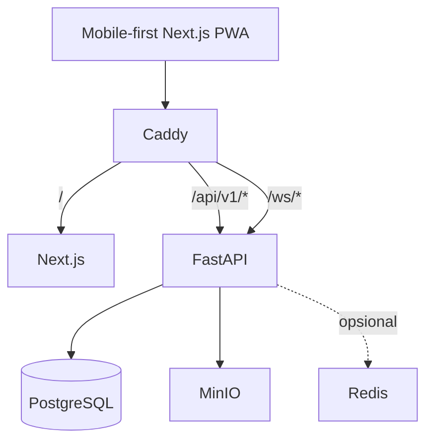

# Arsitektur Jepret

## Runtime foundation

```mermaid
flowchart TD
  PWA["Mobile-first Next.js PWA"] --> Caddy
  Caddy -->|/| Web[Next.js]
  Caddy -->|/api/v1/*| API[FastAPI]
  Caddy -->|/ws/*| API
  API --> DB[(PostgreSQL)]
  API --> MinIO
  API -. opsional .-> Redis
```

## Komponen

- **Caddy (gateway)** — entry point tunggal `:8080`, kompresi, routing same-origin.
- **Next.js (web)** — PWA shell mobile-first, output standalone, TanStack Query boundary.
- **FastAPI (api)** — modular monolith; system routes (`/health`, `/ready`, `/ws/health`), error envelope stabil, correlation ID, structured logging.
- **PostgreSQL** — source of truth; akses async via SQLAlchemy + asyncpg; schema dikelola Alembic.
- **MinIO** — object storage lokal dengan bucket `jepret-public` dan `jepret-private`.
- **Redis** — profile Compose opsional; tidak diperlukan stack dasar.

## Request flow

1. Browser memanggil `http://localhost:8080/...` (satu origin untuk web, REST, dan WebSocket).
2. Caddy meneruskan `/health`, `/ready`, `/api/v1/*`, `/api/docs*`, `/api/openapi.json`, dan `/ws/*` ke FastAPI; sisanya ke Next.js.
3. `CorrelationIdMiddleware` membaca atau membuat `X-Request-ID` dan mengembalikannya pada response.
4. Error API selalu memakai envelope `{"error": {"code", "message", "details"}}`; sukses memakai `{"data": ...}`.

## Auth flow (Phase 2 — implemented)

Authentication berbasis session cookie same-origin tanpa CORS. Password di-hash Argon2id (pwdlib); session opaque token disimpan sebagai hash SHA-256 di tabel `sessions` dengan umur 30 hari. Cookie `jepret_session` bersifat HttpOnly + SameSite=Lax (+Secure di production). Endpoint: `/api/v1/auth/{register,login,logout,me}`, `/api/v1/profiles/*`, `/api/v1/admin/creator-applications*`. Proteksi CSRF: SameSite=Lax dikombinasikan `OriginCheckMiddleware` yang menolak method mutasi dengan header Origin asing (`FORBIDDEN_ORIGIN`). Satu akun dapat mengaktifkan profil kreator (status draft → pending → approved/rejected, approval oleh admin).

## Marketplace flow (Phase 3 — implemented)

Endpoint publik tanpa sesi: `GET /api/v1/creators` (listing profil `approved`
dengan filter `q` ILIKE nama/bio, kota, spesialisasi, rentang harga; paginasi
keyset `reviewed_at DESC, id DESC` dengan cursor base64url) dan
`GET /api/v1/creators/{id}` (404 untuk profil non-approved). Index
`ix_creator_profiles_listing` menopang jalur listing. Frontend: beranda memakai
`useInfiniteQuery` dengan tombol "Muat lebih", detail di `/kreator/[id]`.

## Booking flow (Phase 4 — implemented)

Klien mengajukan booking (`POST /api/v1/bookings`) ke kreator `approved` dengan
tanggal masa depan; harga di-snapshot dari `starting_price_idr`. Status:
`requested → accepted|rejected`, lalu `accepted → completed|cancelled`
(`requested → cancelled` juga sah). Kreator merespons via
`/bookings/{id}/{accept,reject,complete}`; klien maupun kreator dapat
`cancel` selama belum terminal. Semua transisi memakai `SELECT ... FOR UPDATE`;
bentrok tanggal dijamin partial unique index `uq_bookings_accepted_date`
(`DATE_UNAVAILABLE`). Halaman: `/kreator/[id]/booking`, `/booking`,
`/booking/masuk`.

## Planned storage flow (fase fitur)

Upload media memakai bucket privat dengan signed URL berbatas waktu yang diterbitkan API setelah authorization. `JEPRET_MINIO_PUBLIC_ENDPOINT` adalah host MinIO yang dapat dijangkau jaringan browser dan dipakai API untuk menandatangani URL; istilah _public endpoint_ tidak berarti bucket menjadi publik. Bucket `jepret-private` tidak pernah diberi anonymous public-read policy, sedangkan CORS hanya mengizinkan origin aplikasi lokal `http://localhost:8080`.

Browser wajib mengirim header `Content-Type` yang ditandatangani dan `If-None-Match: *` pada signed PUT. Header kedua menjadikan upload create-only sehingga key yang sudah ada tidak dapat ditimpa. Download bucket privat juga hanya melalui signed GET; tidak ada direct anonymous read.

Image MinIO Community yang dipin belum mendukung per-bucket CORS. Compose tetap menyimpan `infra/minio/cors.xml` sebagai policy yang diinginkan dan mencoba menerapkannya, lalu menerima hanya respons `NotImplemented` yang dikenal sebelum memakai fallback server-level `MINIO_API_CORS_ALLOW_ORIGIN=http://localhost:8080`. Fallback membatasi origin, tetapi tidak menjamin `ExposeHeader: ETag` dan `MaxAgeSeconds: 3600` dari XML. Ini tidak mengubah privasi bucket; API memeriksa ETag server-side dan browser tidak mengandalkannya. Object storage production wajib mengonfigurasi policy CORS ekuivalen secara eksplisit, termasuk method `GET`/`PUT`, kedua request header, exposed `ETag`, dan max age.

## WebSocket flow

`/ws/health` adalah probe infrastruktur untuk memvalidasi penerusan upgrade WebSocket oleh gateway. Business WebSocket terautentikasi (chat) ditambahkan pada Phase 6 melalui prefix `/ws/*` yang sama.

## ADR-001: Same-origin Caddy gateway

**Status:** Accepted

Caddy menjadi entry point tunggal agar cookie, CSRF, REST, dan WebSocket memiliki perilaku origin yang konsisten. PostgreSQL tetap internal. API MinIO di-bind khusus ke loopback host untuk signed browser upload lokal; console MinIO tetap hanya tersedia melalui compose debug override.
