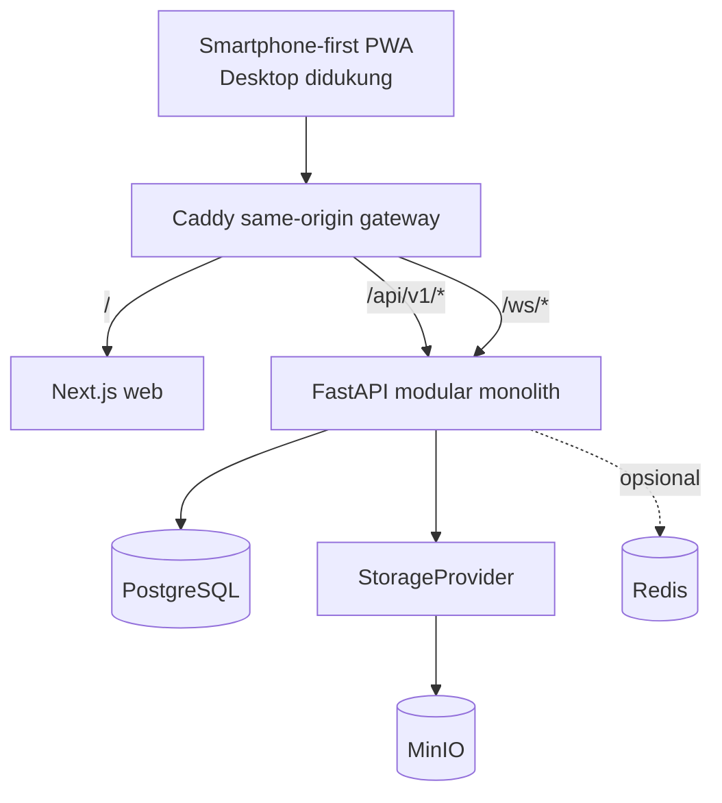

# Desain Foundation Jepret Phase 0–1

**Tanggal:** 2026-07-13
**Status:** Disetujui dalam brainstorming
**Cakupan:** Phase 0 (Discovery dan Plan) serta Phase 1 (Foundation)

## 1. Tujuan

Jepret adalah marketplace mobile-first yang menghubungkan klien dengan fotografer dan videografer terverifikasi. MVP lengkap mencakup identity, creator discovery, booking, payment, chat, deliverables, reviews, disputes, dan administration. Domain tersebut terlalu besar untuk satu siklus implementasi yang aman, sehingga pekerjaan dibagi menjadi fase yang dapat dirancang dan diverifikasi secara mandiri.

Desain ini hanya mencakup foundation yang dibutuhkan vertical slice berikutnya: repository, topologi runtime, batas komponen, strategi kontrak API, UI foundation, infrastruktur lokal, CI, dan quality gates. Fitur bisnis seperti authentication dan booking tidak diimplementasikan dalam fase ini.

Target delivery pertama adalah local development dan CI. Cloud deployment tetap menjadi extension point dan tidak boleh membelokkan arsitektur lokal.

## 2. Bentuk Produk

Produk klien adalah Progressive Web App responsif dan mobile-first berbasis Next.js. Smartphone menjadi pengalaman utama. Layout desktop dan tablet memakai codebase yang sama untuk mendukung workflow kreator dan admin yang lebih lebar.

Aplikasi native Android dan iOS tidak termasuk MVP. Kontrak FastAPI tetap dapat digunakan oleh native client di masa depan jika kebutuhan produk yang telah tervalidasi membenarkannya.

Phase 1 menghasilkan responsive application shell dan arsitektur yang siap dikembangkan menjadi PWA. Manifest lengkap, install prompt, caching policy, dan verifikasi installability tetap berada pada cakupan P1 lanjutan dalam master prompt.

## 3. Arsitektur Terpilih

### 3.1 Keputusan

Gunakan modular monolith di belakang same-origin gateway berbasis Caddy.



Caddy menjadi entry point publik utama. Gateway meneruskan UI, REST API, dan WebSocket melalui satu origin. PostgreSQL dan MinIO tetap berada di internal Compose network. Port debugging langsung hanya boleh diaktifkan melalui development profile eksplisit.

Caddy dipilih karena konfigurasi reverse proxy-nya kecil, mendukung WebSocket tanpa komponen tambahan, dan dapat dipakai secara konsisten pada local development maupun deployment container sederhana. Versi stabil aktual akan dikunci dalam implementation plan.

### 3.2 Alternatif yang dipertimbangkan

**Frontend dan API pada origin terpisah** membuat scaffold awal sedikit lebih sederhana, tetapi menimbulkan perbedaan CORS, cookie, CSRF, dan WebSocket antara development dan production.

**Next.js sebagai Backend-for-Frontend penuh** mengisolasi browser dari FastAPI, tetapi menambah application layer pada setiap request serta mempersulit upload, streaming, dan WebSocket.

Same-origin gateway menambah satu komponen kecil, tetapi memberi model security dan deployment paling konsisten.

## 4. Struktur Repository

Workspace saat ini menjadi root repository; tidak dibuat repository `jepret/` bertingkat.

```text
apps/
  web/                    Aplikasi web Next.js mobile-first
  api/                    FastAPI modular monolith
packages/
  contracts/              Kontrak API TypeScript hasil generate
infra/
  gateway/                Konfigurasi Caddy
docs/
scripts/
.github/workflows/
AGENTS.md
.env.example
docker-compose.yml
Makefile
README.md
```

### 4.1 Batas web

`apps/web` memiliki presentation, interaction, form behavior, responsive layout, accessibility states, dan server-state caching. Web tidak memiliki authorization atau aturan bisnis sensitif.

Feature code dikelompokkan berdasarkan domain. Shared primitives dipisahkan dari feature composition. TanStack Query memakai generated API client. Duplikasi manual schema response backend tidak diperbolehkan.

### 4.2 Batas API

`apps/api` memiliki domain rules, authorization, transactions, persistence, API errors, storage abstraction, dan external integration adapters.

API diorganisasikan berdasarkan domain, bukan global bucket berukuran besar. Route handler tetap tipis. Service yang dapat diuji memuat aturan bermakna. Repository abstraction hanya dibuat jika kompleksitas query atau transaction membenarkannya.

### 4.3 Batas kontrak

OpenAPI FastAPI menjadi source of truth. Command deterministik menghasilkan kontrak TypeScript ke `packages/contracts`. CI gagal ketika generated output yang tersimpan berbeda dari OpenAPI terkini.

Response daftar memakai pagination envelope yang disepakati. Error API memakai:

```json
{
  "error": {
    "code": "STABLE_MACHINE_CODE",
    "message": "Pesan yang aman untuk pengguna.",
    "details": {}
  }
}
```

## 5. Runtime Lokal

Docker Compose berisi:

- `gateway`: Caddy sebagai entry point aplikasi;
- `web`: runtime Next.js;
- `api`: runtime FastAPI;
- `db`: PostgreSQL dengan named volume;
- `minio`: local S3-compatible storage dengan named volume;
- `minio-init`: inisialisasi bucket lokal yang idempotent;
- `redis`: profile opsional, bukan dependency wajib.

`docker compose up --build` menjalankan stack lokal yang wajib. Task runner terdokumentasi menyediakan command singkat tanpa menyembunyikan operasi dasarnya.

Alembic migration dijalankan sebagai command eksplisit atau one-shot job. Migration tidak berjalan otomatis pada setiap startup proses API. Service readiness menggunakan health check, bukan asumsi waktu startup.

## 6. Alur Data dan Request

```text
PWA -> Caddy -> Next.js
PWA -> Caddy /api/v1/* -> FastAPI -> PostgreSQL
PWA -> Caddy /ws/* -> authenticated FastAPI WebSocket
FastAPI -> StorageProvider -> MinIO
FastAPI -> cache/rate-limit adapter -> Redis opsional
```

PostgreSQL menjadi source of truth. Redis tidak pernah menyimpan authoritative business state. Data real-time penting disimpan sebelum disiarkan. Frontend tidak pernah terhubung langsung ke PostgreSQL atau MinIO.

Upload public dan private di masa depan diotorisasi oleh FastAPI. Storage boundary mendukung signed URL agar file besar tidak harus melewati proses API. Akses object private harus time-limited dan authorization-aware.

## 7. Foundation Authentication

Authentication diimplementasikan pada Phase 2, tetapi Phase 1 wajib mempertahankan constraint berikut:

- FastAPI memiliki keputusan authentication dan session.
- Access credential berumur pendek dan refresh credential yang dirotasi menggunakan cookie `HttpOnly`.
- Cookie production memakai `Secure` dan kebijakan `SameSite` yang sesuai.
- Request yang mengubah state dilindungi CSRF.
- Refresh credential dapat dicabut.
- Caddy mempertahankan cookie, forwarding headers, request ID, dan WebSocket upgrade.
- Backend authorization tetap wajib pada setiap protected action.

Phase 1 tidak membuat login sementara atau protected route palsu.

## 8. Error Handling dan Observability

Setiap request menerima atau meneruskan correlation ID. FastAPI mengubah expected dan unexpected failure menjadi error envelope konsisten tanpa mengembalikan stack trace.

Validation, authentication, authorization, conflict, rate-limit, dan internal error memperoleh stable machine code. Structured log memuat correlation ID, route, status, dan duration. Log tidak memuat password, token, cookie, secret, sensitive payment metadata, atau private file URL.

Next.js menyediakan error boundary tingkat aplikasi dan feature. Error penting pada form atau halaman tampil inline; toast dibatasi untuk feedback singkat. Caddy mengembalikan response service-unavailable sederhana ketika upstream tidak tersedia.

`/health` melaporkan kesehatan proses. `/ready` melaporkan ketersediaan dependency yang diperlukan untuk menerima traffic. Output health publik tidak mengekspos credential atau detail infrastruktur internal.

## 9. UI Foundation

Arah visual adalah premium, editorial, warm, minimal, dan mobile-first.

Foundation mendefinisikan semantic CSS variables untuk background, foreground, surface, surface foreground, muted, border, primary, primary foreground, success, warning, dan destructive. Feature code tidak boleh mengulang hard-coded palette values.

Editorial display typography dipasangkan dengan sans-serif yang sangat terbaca untuk body text, form, price, status, dan chat. Palet memadukan near-black background, warm cream surface, amber atau gold emphasis, subtle border, moderate radius, dan restrained shadow.

Mobile shell memakai compact header serta model navigasi klien: Jelajah, Booking, Chat, dan Profil. Layout lebar mengadaptasi information architecture yang sama, bukan menjadi produk terpisah.

Accessibility baseline:

- touch target minimal 44px;
- keyboard focus terlihat jelas;
- semantic landmark dan accessible name tersedia;
- color contrast diverifikasi;
- reduced-motion preference dihormati;
- form menyediakan ruang untuk label dan error;
- loading, empty, error, dan success state memiliki pola yang terdefinisi.

Phase 1 tidak mengimplementasikan layar marketplace, booking, atau chat final. Shell boleh memuat realistic non-interactive preview content, tetapi tidak boleh menampilkan core action palsu seolah-olah berfungsi.

## 10. Strategi Verifikasi

### 10.1 Backend

Unit test mencakup configuration parsing, error mapping, correlation ID behavior, dan readiness logic. Integration test mencakup application lifecycle, PostgreSQL connectivity, health/readiness behavior, dan migration dari database kosong.

### 10.2 Frontend

Component test mencakup application shell, responsive navigation, design token, loading dan error boundary, serta basic accessibility behavior.

### 10.3 Kontrak dan runtime

Contract verification mendeteksi drift OpenAPI dan generated TypeScript. Compose smoke test memverifikasi konektivitas Caddy-ke-web serta Caddy-ke-API. Playwright membuka homepage pada mobile viewport dan mengakses API health route melalui gateway.

### 10.4 Quality commands

Task runner mengekspos command konsisten yang setara dengan:

```text
make format
make lint
make typecheck
make test
make build
make verify
```

CI menjalankan format check, lint, type-check, backend unit dan integration test, frontend test, contract check, build, serta smoke suite yang feasible.

## 11. Kriteria Selesai Phase 1

Phase 1 hanya selesai ketika:

1. Git dan monorepo telah diinisialisasi.
2. `docker compose up --build` menjalankan seluruh service lokal wajib.
3. Mobile-first homepage shell dapat diakses melalui satu origin.
4. `/health` dan `/ready` berperilaku benar.
5. Alembic memigrasikan database PostgreSQL kosong.
6. OpenAPI menghasilkan kontrak TypeScript secara deterministik.
7. Startup memvalidasi environment configuration.
8. `.env.example` memuat setiap variable wajib tanpa secret.
9. CI menjalankan quality gates yang disetujui.
10. Setup, architecture decision, dan troubleshooting terdokumentasi.

## 12. Non-Goal Eksplisit

Phase 1 tidak mengimplementasikan:

- authentication atau user profile;
- creator onboarding atau verification;
- marketplace search, portfolio, package, atau availability;
- booking atau payment state machine;
- chat, deliverable, review, dispute, atau admin feature;
- production deployment;
- native Android atau iOS;
- full PWA installation dan offline transaction behavior.

Semua hal tersebut menjadi siklus desain dan implementasi lanjutan yang berurutan. Core path tidak boleh direpresentasikan oleh tombol mock yang menyesatkan.

## 13. Risiko dan Mitigasi

| Risiko | Mitigasi |
|---|---|
| Cakupan MVP melampaui kapasitas satu siklus implementasi | Gunakan spec dan plan terpisah untuk domain serta fase yang bounded. |
| Development Windows berbeda dari CI Linux | Jalankan workflow utama melalui container atau cross-platform task command. |
| Perilaku cookie dan WebSocket berbeda pada fase berikutnya | Verifikasi same-origin forwarding Caddy dalam Phase 1. |
| Kontrak frontend dan API mengalami drift | Generate client dari OpenAPI dan wajibkan CI drift check. |
| Service startup dalam urutan yang salah | Gunakan health/readiness check serta migration job eksplisit. |
| Dependency API berubah | Pilih versi stabil kompatibel dalam implementation plan dan lock versinya. |
| Local state hilang tanpa disengaja | Gunakan named volume PostgreSQL dan MinIO serta dokumentasikan reset dan backup. |
| Infrastruktur opsional menjadi wajib tanpa sengaja | Uji stack wajib tanpa Redis aktif. |

## 14. Urutan Desain Lanjutan

Setelah foundation ini diimplementasikan dan diverifikasi, lanjutkan dengan siklus desain bounded berikut:

1. authentication serta client/creator profile;
2. marketplace catalog, portfolio, package, availability, dan discovery;
3. booking state machine dan notification;
4. payment adapter dan mock provider;
5. chat, attachment, dan deliverable;
6. completion, review, dispute, dan administration;
7. hardening, seed data lengkap, accessibility, performance, serta production readiness.

Setiap siklus memiliki approved spec, implementation plan, migration, authorization test, dan bukti quality gate sendiri.
